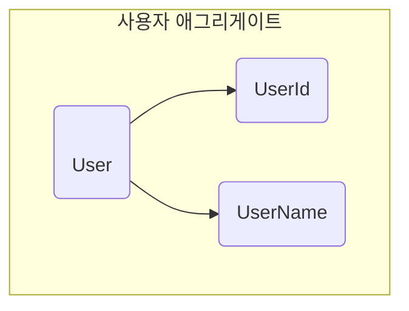
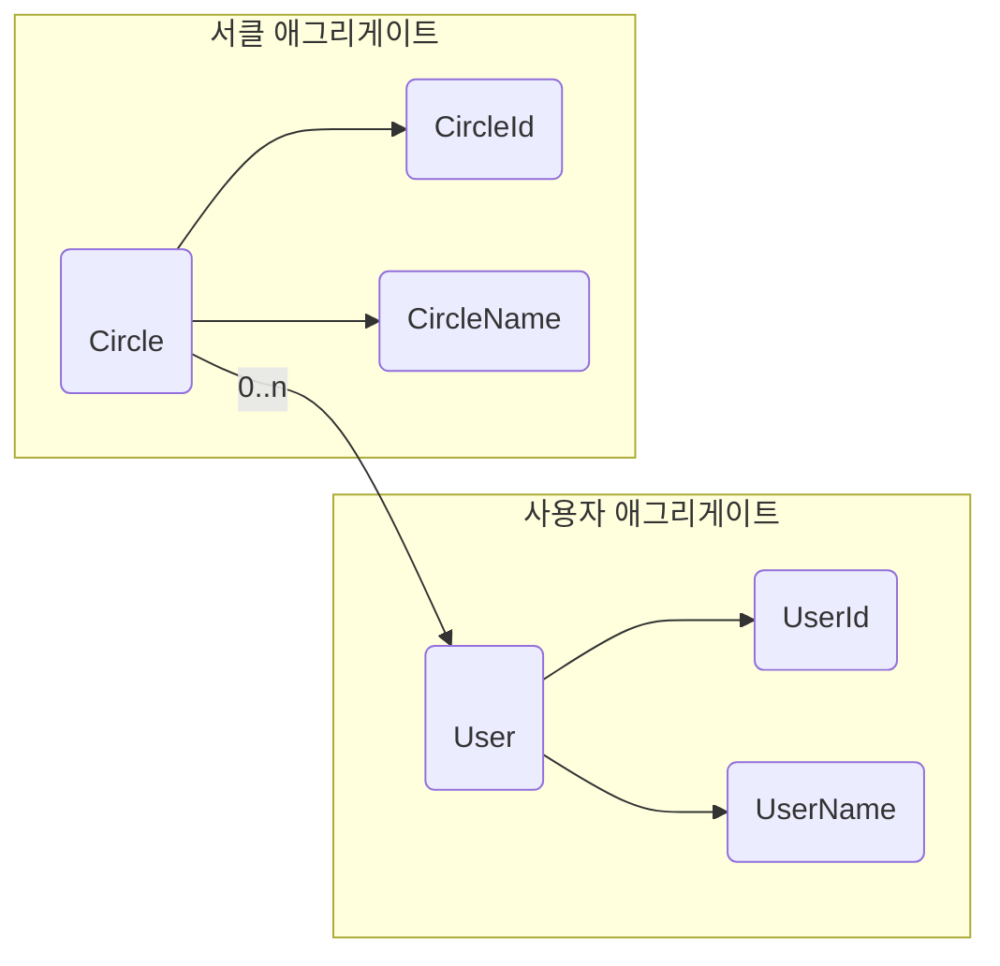
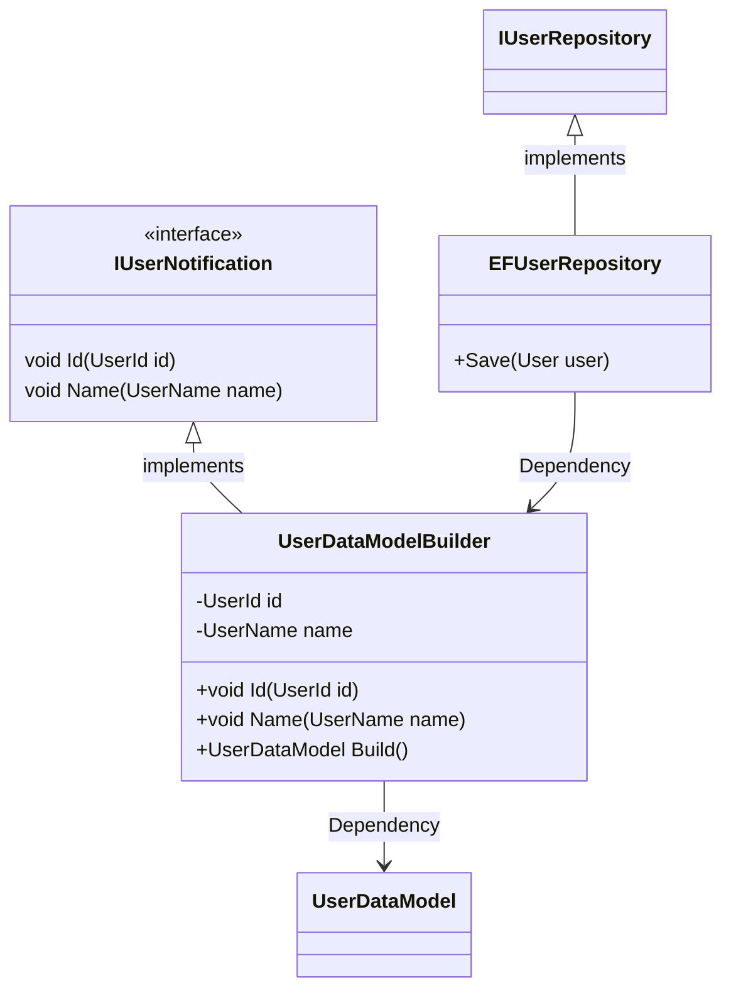
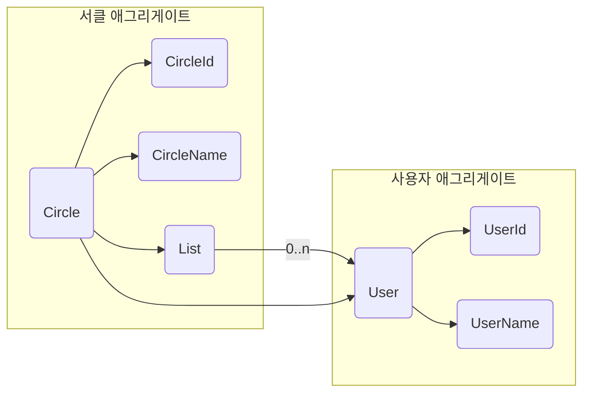

## 1. 애그리게이트란?

* 애그리게이트는 불변 조건을 유지하는 단위로 꾸려지며 객체 조작의 질서를 유지한다.
* 애그리게이트는 **[+경계와 루트+]** 를 갖는다.
  - 경계는 말 그대로 애그리게이트에 포함되는 대상을 결정하는 경계
  - 루트는 애그리게이트에 포함되는 특정한 객체
* 외부에서 애그리게이트를 다루는 조작은 모두 루트를 거쳐야만 한다.
* 애그리게이트에 포함되는 객체를 외부에 노출하지 않음으로써 불변의 조건을 유지 할 수 있다.


### 1.1 애그리게이트의 기본 구조

* 애그리게이트는 서로 연관된 객체를 감싸는 경계를 통해 정의 된다.



* 외부에서는 애그리게이트 내부에 있는 객체를 조작할 수 없다.
* 오직, 애그리게이트 루트(aggregate root)로만 조작이 가능하다.

```cs
var userName = new UserName("NewName");

//NG
user.Name = userName;

// OK
user.ChangeName(userName);
```

* ChangeName 매서드를 만들면 메서드를 통해 전달받은 값을 확인(null 체크 등) 할 수 있다.




```
circle.Members.Add(member);
```

* 위 코드는 애그리게이트의 규칙을 위반하는 코드이다.
* 서클 애그리게이트에 포함되는 Members에 대한 조작은 애그리게이트의 루트인 Circle 객체를 통해야 한다.


```cs
public class Circle
{
  private readonly CircleId id;
  private User owner;
  // 소속된 사용자 목록을 비공개로 돌린다.
  private List<User> members;

  (... 생략 ...)

  public void Join(User member)
  {
    if(member == null)
      throw new ArgumentNullException(nameof(member));

      if(members.Count >= 29)
        throw new CircleFullException(id);
      
      members.Add(member);
  }
}

```

* members 속성이 외부에 공개되지 않으므로 서클에 새로운 사용자를 추가하려면 Join 메서드를 호출하는 방법이다.

```
circle.Join(user);
```

* 객체 지향 프로그래밍에서는 외부에서 내부 객체를 직접 다루는 대신, 내부 객체를 감싸는 객체에 요청하는 형태를 취한다.
* 이런 방법으로 불변 조건을 유지하면서도 직관과 좀 더 일치하는 코드를 만들 수 있다.
* [+데메테르의 법칙+]으로 알려진 규칙이다.

### 1.2 객체를 다루는 조작의 기본 원칙

* `데메테르의 법칙`은 객체 간의 메서드 호출에 질서를 부여하기 위한 가이드라인이다.
* 데메테르의 법칙은 어떤 컨텍스트에서 다음 객체의 메서드만을 호출할 수 있게 제한한다.
  * 객체 자신
  * 인자로 전달받은 객체
  * 인스턴스 변수
  * 해당 컨텍스트에서 직접 생성한 객체

```cs
if(circle.Members.Count >= 29)
{
  throw new CircleFullException(id);
}
```

* 위 코드는 서클에 소속된 사용자의 수가 규칙에 정해진 최대 인원을 초과하는지 확인하는 코드로, Circle 객체의 속성인 Mmebers에 직접 접근해 Count 메서드를 호출한다.
* [-메서드를 사용할 수 있는 객체의 범위-] 벗어나기 때문에 데메테르의 법칙을 위반한 코드이다.
  
```cs
public class Circle
{
  private readonly CircleId id;
  // 멤버 목록을 비공개로 함
  private List<User> members;

  (... 생략 ...)

  public bool IsFull()
  {
    return members.Count >= 29;
  }

  public void Join(User user)
  {
    if(user == null)
      throw new ArgumentNullException(nameof(user));
    
    if(IsFull())
      throw new CircleFullException(id);
    
    members.Add(user);
  }
}
```

* 최대 인원에 도달했는지 여부는 isFull 메서드를 통해 확인한다.

```cs
if(circle.IsFull())
{
  throw new CircleFullException(circleId);
}
```

* 서클의 최대 인원수와 관련된 지식은 모두 isFull 메서드에 집중돼 있다.
  
```cs
public class Circle
{
  (... 생략 ...)

  public bool IsFull()
  {
    // return member.Count >= 29;
    return members.Count >= 49;
  }
}
```

* 게터를 통해 필드를 공개하면 객체에 구현돼야 할 규칙이 다른 곳에서 중복 구현되는 일을 완전히 막을 수 없다.
* 데메테르의 법칙은 소프트웨어의 유지 보수성을 향상시키고 코드를 더욱더 유연하게 한다.

### 1.3 내부 데이터를 숨기기 위해

* 객체 내부의 데이터를 함부로 외부에 공개돼서는 안 된다.
* 그러나 데이터를 외부에 전혀 공개하지 않으면 리포지토리가 객체를 데이터스토에에 저장 할 수가 없다.

```cs
public class EFUserRepository : IUserRepository
{
  public void Save(User user)
  {
    // 게터를 이용해 데이터를 옮겨담는다.
    var userDataModel = new UserDataModel
    {
      Id = user.Id.Value,
      Name = user.Name.Value
    }
    context.Users.Add(userDataModel);
    context.SaveChanges();
  }
  (... 생략 ...)
}
```

* EFUserRepository는 User 클래스의 객체를 저장할 때 프레임워크에서 사용되는 데이터 모델인 UserDataModel로 데이터를 옮겨 담는다.
* UserDataModel 객체를 생성하려면 User 클래스의 Id와 Name에 접근해야 하므로 User 클래스가 Id와 Name을 완전히 비공개로 하면 이 코드는 컴파일 애러를 일으킨다.

* 가장 단순하고 일반적인 해결체는 팀 내에 규칙을 정해 리포티토리 객체외에는 애그리게이트의 내부 데이터에 접근하는 코드를 작성하지 말자고 할 수 있다.
* 또 다른 방법은 노티피케이션 객체를 이용하는 것이다.

```cs
public interface IUserNotification
{
  void Id(UserId id);
  void Name(UserName name);
}
```

```cs
public class UserDataModelBuilder : IUserNotification
{
  // 전달 된 데이터는 인스턴스 변수로 저장된다.
  private UserId id;
  private UserName name;

  public void Id(UserId id)
  {
    this.id = id;
  }

  public void Name(UserName name)
  {
    this.name = name;
  }

  // 전달 받은 데이터로 데이터 모델을 생성하는 메서드
  public UserDataModel Build()
  {
    return new UserDataModel
    {
      Id = id.Value,
      Name = name.Value
    };
  }
}
```
* User 클래스는 노티피케이션의 객체의 인터페이스를 통해 내부 정보를 전달 받는다.

```cs
public class User
{
  // 인스턴스 변수는 모두 비공개
  private readonly UserId id;
  private UserName name;

  (...생략 ...)

  public void Notify(IUserNotification note)
  {
    // 내부 데이터를 전달
    note.Id(id);
    note.Name(name);
  }
}
```
* 객체의 내부 데이터는 비공개로 그대로 두면서 외부에 데이터를 전달 할 수 있다.

```cs
public class EFUserRepository : IUserRepository
{
  public void Save(User user)
  {
    // 노티피케이션 객체를 전달했다가 다시 회수해 내부 데이터를 입수한다.
    var userDataModelBuilder = new UserDataModelBuilder();
    user.Notify(userDataModelBuilder);

    // 전달 받은 내부 데이터로 데이터 모델을 생성
    var userDataModel = userDataModelBuilder.Build();

    // 데이터 모델을 ORM에 전달한다.
    context.Users.Add(userDataModel);
    context.SaveChanges();
  }

  (... 생략 ...)
}

```




## 2. 애그리게이트의 경계를 어떻게 정할 것인가

* 애그리게이트의 경계를 정하는 원칙 중 가장 흔히 쓰이는 것은 `변경의 단위`이다.




* 서클과 사용자는 별개의 애그리게이트이므로 서클을 변경할 때는 서클 애그리게이트 내부로 변경이 제한돼야 하고, 사용자를 변경할 때도 사용자 애그리게이션 내부의 정보만 변경돼야 한다.
* 만약, 이러한 규칙을 위반하고 서클 애그리게이트에서 자신의 경계를 넘어 사용자 애그리게이트까지 변경하려고 하면 프로그램에 어떤 일이 일어날까?

```cs
public class Circle
{
  private List<User> members;

  (... 생략 ...)

  public void ChangeMemberName(UserId id, UserName name)
  {
    var target = members.FirstOrDefault(x => x.Id.Equals(id))
    if(target != null)
    {
      target.ChangeName(name);
    }
  }
}
```

* 서클 애그리게이트가 자신의 경계를 넘어 사용자 애그리게이트를 조작하면 그 영향이 리포지토리에 나타난다.
* 아래는 서클 애그리게이트의 퍼시스턴시 처리 코드이다.


```cs
public class CircleRepository : ICircleRepository
{
  (... 생략 ...)

  public void Save(Circle circle)
  {
    using(var command = connection.CreateCommand())
    {
      command.CommandText = @"
        MERGE INTO circles  
        USING(
          SELECT @id AS id, @name AS name, @ownerId AS ownerId
        ) AS data
        ON circles.id = data.id
        WHEN MATCHED THEN
        UPDATE SET name = data.name, ownerId = data.ownerId
        WHEN NOT MATCHED THEN
        INSERT (id, name, ownerId)
        VALUES (data.id, data.name, data.ownerId);
      ";

      command.Parameters.Add(new SqlParameter("@id", circle.Id.Value));
      command.Parameters.Add(new SqlParameter("@name", circle.Name.Value));
      command.Parameters.Add(new SqlParameter("@ownerId", (object)circle.Owner?.Id.Value ?? DBNull.Value));
      command.ExecuteNonQuery();
    }

    using(var command = connection.CreateCommand())
    {
      command.CommandText = @"
        MERGE INTO userCircles  
        USING(
          SELECT @userId AS userId, @circleId AS circleId
        ) AS data
        ON userCircles.userId = data.userId AND userCircles.circleId = data.circleId
        WHEN MATCHED THEN
        INSERT (userId, circleId)
        VALUES (data.userId, data.circleId);
      ";

      command.Parameters.Add(new SqlParameter("@circleId", circle.Id.Value));
      command.Parameters.Add(new SqlParameter("@userId", null));
      
      foreach (var member in circle.Members)
      {
        command.Parameters["@userId"].Value = member.Id.Value;
        command.ExecuteNonQuery();
      }
      
    }
  }
}
```

* 서클 애그리게이트가 자신의 경계를 넘어 사용자 애그리게이트의 데이터를 변경한다.
* 이 상태로는 경계 너머 사용자 애그리게이트를 변경한 내용이 저장되지 않는다. 그래서 리포지토리를 수정해야 한다.

```cs
public class CircleRepository : ICircleRepository
{
  (... 생략 ...)
  
  public void Save(Circle circle)
  {
    // 사용자 애그리게이션에 대한 업데이트 처리
    using( var command = connection.CreateCommand())
    {
      command.CommandText = "UPDATE users SET username = @username WHERE id = @id";
      command.Parameters.Add(new SqlParameter("@id", null));
      command.Parameters.Add(new SqlParameter("@username", null));

      foreach(var user in circle.Members)
      {
        command.Parameters["@id"].Value = user.Id.Value;
        command.Parameters["@username"].Value = user.Name.Value;
        command.ExecuteNonQuery();
      }
    }

    // 서클 애그리게이션에 대한 업데이트는 그 다음
    (... 생략 ...)
  }
}
```

* 리포지토리를 수정한 결과, [-서클 리포지토리의 로직 대부분이 사용자의 정보를 수정하는 코드로 오염됐다.-]
* 더불어 서클 리포지토리에 새로 추가된 코드의 대부분이 사용자 리포지토리의 코드와 중복 된다.

<br>

* 애그리게이트에 대한 변경은 해당 애그리게이트 자신에게만 맡기고, 퍼시스턴시 요청도 애그리게이트 단위로 해야 한다.
* 해당 이유로 인해 [+리포지토리는 애그리게이트마다 하나씩 만든다.+]

### 2.1 식별자를 이용한 컴포지션

* Circle 객체는 User 클래스의 인스턴스를 컬렉션 객체에 저장하고 프로퍼티를 통해 객체에 접근해 메서드를 호출 할 수 있다.
* 하지만, 이것 자체를 문제로 보는 시각이 많다.
* `애그리게이트의 경계를 넘지 않는다는 불문율을 만드는 것보다 더 나은 방법이 없을까?`

<br/>

* [+인스턴스를 갖지 않도록 하면 된다.+]
* 인스턴스를 실제로 갖지는 않지만 그런 것처럼 보이게끔 하는것, `엔티티의 식별자`를 사용하면 된다.


```cs
public class Circle
{
  public CircleId Id { get; }
  public CircleName Name { get; private set;}
  //public List<User> Members { get; private set; }
  public List<UserId> Members { get; private set; }

  (... 생략 ...)
}
```

* 이러한 방법을 사용하게 된다면 User 객체의 메서드를 호출 할 일은 없을 것이다.
* 이러한 절차를 강제한다면 부주의하게 메서드를 호출해 애그리게이트 너머의 영역을 변경하는 일은 일어나지 않는다.
* 또한 메모리를 절약하는 효과가 있는데 아래는 서클명을 변경하는 처리 코드이다.

```cs
public class CircleApplicationService
{
  private readonly ICircleRepository circleRepository;

  (... 생략 ...)

  public void Update(CircleUpdateCommand command)
  {
    using(var transaction = new TransactionScope())
    {
      var id = new CircleId(command.Id);
      // 이 지점에서 User 객체가 복원되지만,
      var circle = circleRepository.Find(id);
      if(circle == null)
        throw new CircleNotFoundException(id);
      
      if(command.Name != null)
      {
        var name = new CircleName(command.Name);
        circle.ChangeName(name);

        if(circleService.Exists(circle))
          throw new CanNotRegisterCircleException(circle, "이미 등록된 서클임");

        circleRepository.Save(circle);

        transaction.Complete();

        // User 객체를 사용하지 않고 처리가 끝남
      }
    }
  }
}
```

* Circle 객체가 소속 사용자를 User 객체 형태로 포함하는 경우 리포지토리가 사용자 객체를 복원해도 전혀 사용되지 않고 버려진다. (리소스 낭비)
* User 객체를 직접 포함하는 대신 UserId를 포함하면 소속 사용자는 모든 User 객체를 복원할 만큼의 처리 능력을 절약할 수 있을 것이고 인스턴스를 저장하기 위한 메모리도 절약될 것이다.


## 3. 애그리게이트의 크기와 조작의 단위

* 애그리게이트의 크기는 가능한 한 작게 유지하는 것이 좋다.
* 한 트랜잭션에서 여러 애그리게이트를 다루는 것도 가능한 한 피해야 한다.
* 여러 애그리게이션에 걸친 트랜잭션은 범위가 큰 애그리게이트와 마찬가지로 광범위한 데이터에 로크를 걸 가능성이 높다.

## 4. 언어 표현과의 모순 제거

* 서클의 규칙 중 `서클에 소속되는 인원은 서클장을 포함해 최대 30명까지 허용된다.`이 있다.
* 30이라는 구체적인 수치가 규칙에 실려 있지만, 정작 코드에 나오는 수치는 29이다.

```cs
public class Circle
{
  private User owner;
  private List<User> members;

  (... 생략 ...)

  public bool IsFull()
  {
    return members.Count >= 29;
  }
}
```

* 표면적인 수치에 차이가 있어도 정상적인 코드이다.
* 하지만 코드에 문제가 없다고 해서 언어 표현과의 모순을 그대로 두면 오해를 일으키기 쉽다.

```cs
public class Circle
{
  private User owner;
  private List<User> members;

  (... 생략 ...)

  public bool IsFull()
  {
    return CountMembers() >= 30;
  }

  public int CountMembers()
  {
    return members.Count + 1;
  }
}
```